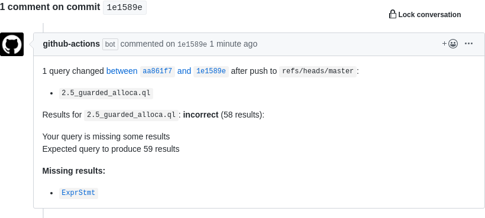

# Actions for Learning Lab CodeQL Courses

This repository provides Docker images and GitHub Actions
for use in CodeQL courses
on [Learning Lab](https://lab.github.com/).

These actions allow you to specify workflows
that can check that course participants' queries are correct,
by running their queries against a well-known CodeQL database,
and checking the results are as expected.
Whatever the outcome,
the action will post a comment on the commit which was pushed
to add the queries.

When a user's results are incorrect,
the comment will include details of which results are missing,
and which are superfluous,
including links to the lines of source code on GitHub when possible.

## Usage

TODO

## Example Courses

There are currently no published courses that use this repository,
when this changes, we'll add a list here.

Feel free to add your own courses to this list!
See [CONTRIBUTING.md](CONTRIBUTING.md).

## License

The code in this repository is licensed under MIT (see [LICENSE.md](LICENSE.md)),
however as it makes use of the CodeQL CLI,
usage of this repository is subject to the
[GitHub CodeQL Terms and Conditions](https://securitylab.github.com/tools/codeql/license),
(whenever your usage involves the CodeQL CLI).

In particular,
you are not permitted to use these docker images or actions
to interact with the CodeQL CLI in CI/CD,
as per the [terms & conditions](https://securitylab.github.com/tools/codeql/license):

> **the Software cannot be used** ... **For automated analysis, continuous integration or continuous delivery, whether as part of normal software engineering processes or otherwise.**

